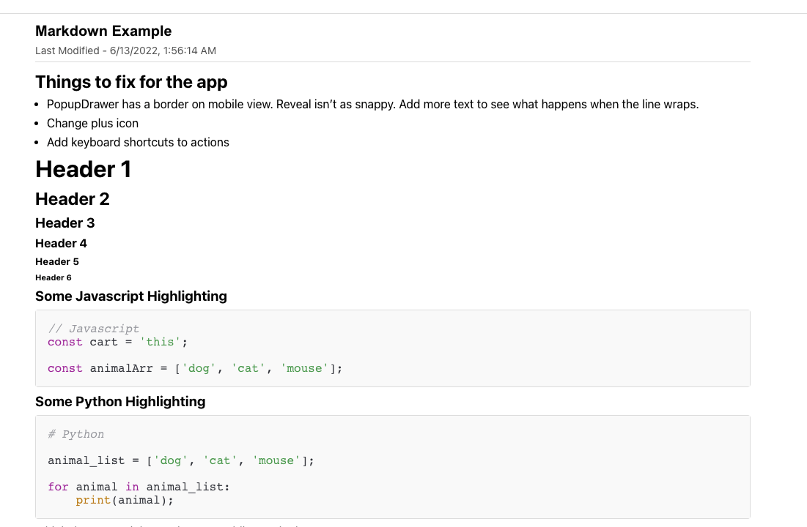
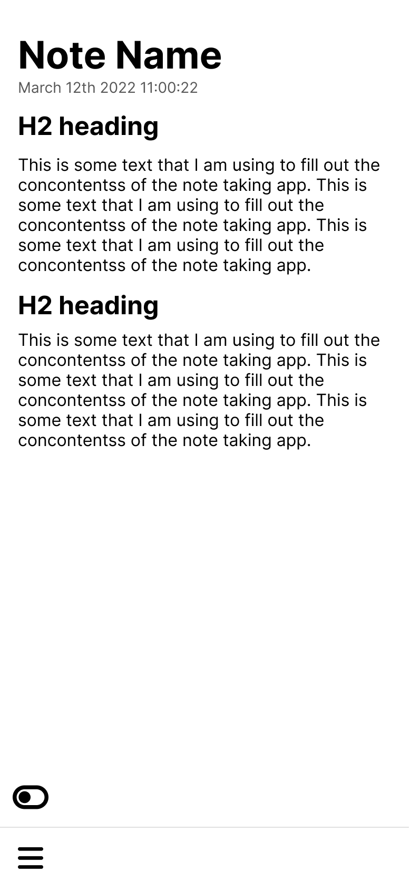
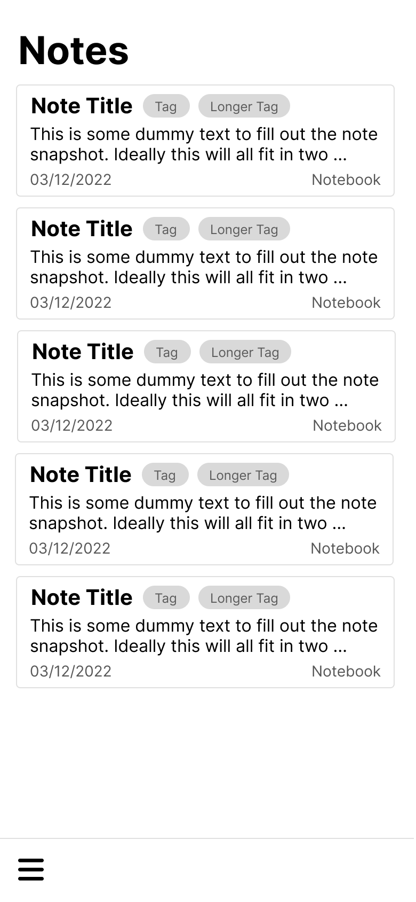
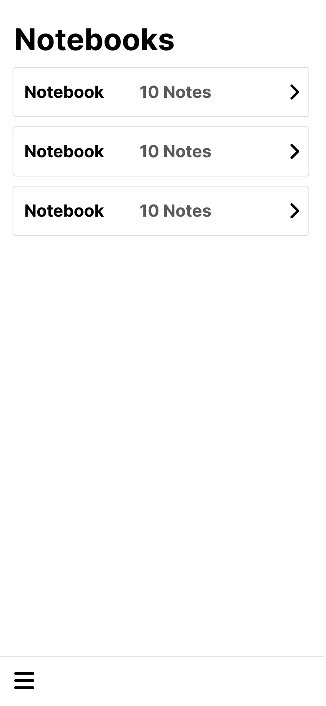

# Hoja

    
    <h1>Hoja</h1>
    <h3><a href="https://hoja-note.herokuapp.com/" target="_blank">Visit Hoja</a></h3>
    <h3>Roger Davila</h3>
         
    

# About Hoja
Hoja is a simple and minimal markdown note taking app focused on letting you have access to your notes no matter what device or browser you are using. Store your notes in notebooks to stay organized and preview the markdown text as you type. 

# How to Use Hoja

### The Basics
The note app is very simple and intuitive to use. All the operations are handled by the popup menu on the bottom right of the application. The menu will give you the option to  make a new note, delete a note, move a note to a notebook, etc. The menu adapts depending on the page that you are on, giving you the controls you need within the application.

 :art: Wireframes

I used figma to quickly sketch up some basic views and wireframes to get a feel of what the application will be like. I went with a mobile first approach to make sure that the experience is enjoyable on smaller screens.

.table-wrapper {
  overflow-x: scroll;
}

| View | Image |
|------------ | ------------|
| 
Note Page
 |  |
| 
Notes Page
 |  |
| 
Notebooks Page
 |  |

:white_check_mark: Planning

Used Trello to keep track of the user stories that were being implemented for this project. Pre-defining what we wanted the user to experience to be allowed the project executions phase to go smoothly.

[Trello Board Planning!](https://trello.com/b/YGzwtS0U/hoja)

## :computer: Technologies Used

 
 
 

# Getting Started

[Click to Visit Hoja!](https://hoja-note.herokuapp.com/)

## :fast_forward: Next Steps 
### Upcoming Features
- [ ] Searching
- [ ] App Themes
- [ ] Note encryption
- [ ] Tagging Notes
- [ ] More menu controls
- [ ] Keyboard shortcuts
- [ ] UI Animations